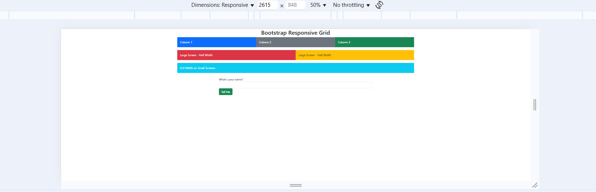
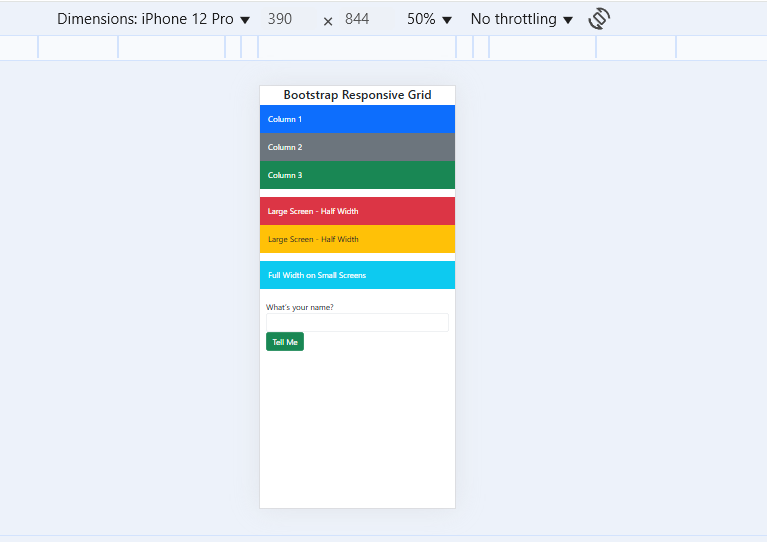
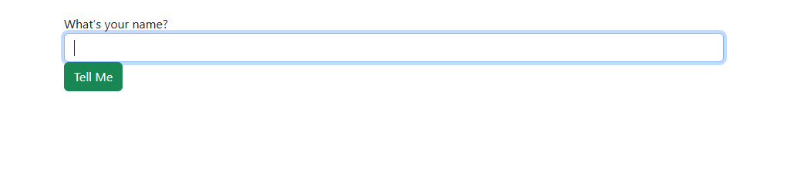
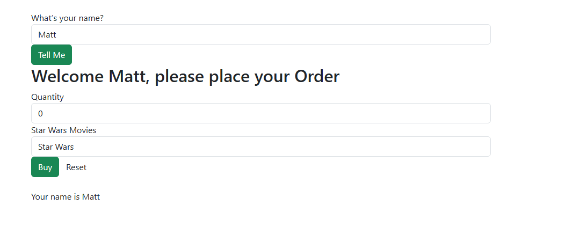
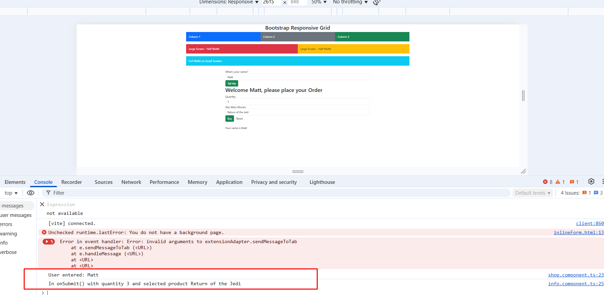

# CST-391: JavaScript Web Application Development  
**Matt Kollar**  
**03/20/2025**  

---

## Part 1: Basic Angular Components, Events, Routes, and Data Binding  

### Screenshots  

#### 1. Responsive Grid Demo  
**Large screen layout:**  
  

**Small screen layout:**  
  

#### 2. Initial Name Input  
**Before entering a name:**  
  

#### 3. Name Submitted  
**After entering a name and clicking "Tell Me":**  
  

#### 4. Product Selection and Purchase  
**Console output showing selected quantity and product after clicking "Buy":**  
  

---

### Research Questions  

#### 1. Describe `@Input` Decorator in `info.component.ts`  
The `@Input` decorator in Angular allows a child component to receive data from a parent component. In `info.component.ts`, the `@Input` decorator is used to pass the `name` property from `shop.component.ts` to `info.component.ts`, allowing dynamic updates based on user input.

#### 2. Describe `[value]` Used in `info.component.html`  
The `[value]` binding in Angular is used to set the value of an element dynamically. In `info.component.html`, it is applied to the `<option>` tag within a `<select>` dropdown, ensuring that each option gets a dynamic value based on the `products` array.

#### 3. Describe `[(ngModel)]` in `info.component.html`  
`[(ngModel)]` is a two-way data binding directive in Angular that connects an input field to a component property. It allows real-time synchronization between the input value and the component’s variable. In `info.component.html`, it binds the `quantity` and `selectedProduct` fields, enabling user input to directly update the component's properties.

---

## Part 2: Music Service Implementation  

### Screenshots  

#### 1. Initial Application Page  
  

#### 2. GCU Homepage  
  

#### 3. Create Album Page  
  

#### 4. About Box  
  

---

### Research Question: Commented `music-service.service.ts`  

```typescript
/**
 * MusicServiceService - Handles the retrieval and management of music data.
 * This service fetches data from a local JSON file and provides methods 
 * to retrieve and manipulate the album and artist data.
 */

import { Injectable } from '@angular/core';
import { HttpClient } from '@angular/common/http';
import { Observable, of } from 'rxjs';
import { catchError, tap } from 'rxjs/operators';
import { Artist } from '../models/artist.model';
import { Album } from '../models/album.model';

@Injectable({
  providedIn: 'root'
})
export class MusicServiceService {
  
  /** The location of the JSON file containing album data */
  private musicDataUrl = 'assets/sample-music-data.json';

  /** Local storage for albums */
  albums: Album[] = [];

  /**
   * Constructor - Initializes the HTTP client and loads albums on service creation.
   * @param http Injected HttpClient for making requests.
   */
  constructor(private http: HttpClient) {
    this.loadAlbums();
  }

  /**
   * Loads the album data from the JSON file and populates the albums array.
   * Uses RxJS `tap` to log the fetched data and `catchError` to handle errors.
   */
  private loadAlbums(): void {
    console.log("Fetching JSON from: ", this.musicDataUrl);

    this.http.get<Album[]>(this.musicDataUrl)
      .pipe(
        tap((data) => console.log("✅ Loaded albums: ", data)),
        catchError((error) => {
          console.error("❌ Error fetching albums:", error);
          return of([]); // Returns an empty array on error
        })
      )
      .subscribe((data) => this.albums = data);
  }

  /**
   * Retrieves a list of unique artists from the albums array.
   * @returns Observable containing an array of Artist objects.
   */
  public getArtists(): Observable<Artist[]> {
    let artistSet = new Set<string>();
    this.albums.forEach(a => artistSet.add(a.artist));

    let artists: Artist[] = Array.from(artistSet).map(artist => ({ artist }));
    return of(artists);
  }

  /**
   * Retrieves all albums from the stored album list.
   * @returns Observable containing an array of Album objects.
   */
  public getAlbums(): Observable<Album[]> {
    return of(this.albums);
  }

  /**
   * Adds a new album to the album list.
   * @param album The album object to be added.
   * @returns Observable containing the album's ID.
   */
  public createAlbum(album: Album): Observable<number> {
    this.albums.push(album);
    console.log("✅ Album Created:", album);
    return of(album.albumId);
  }
}
